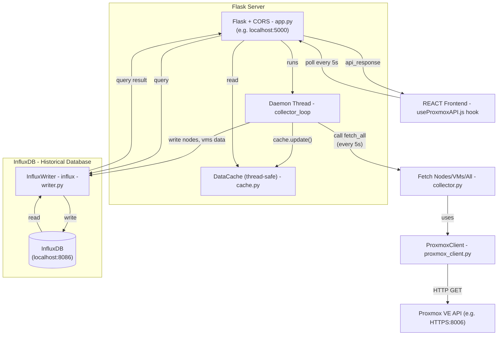

# Security Dashboard for University Laboratory (SDUL)
A real-time monitoring dashboard for Proxmox VE university-lab environments. A Python/Flask backend polls the Proxmox API on a background thread and exposes a lightweight REST API; a React frontend consumes it and auto-refreshes every 5 seconds.

---

## Backend Architecture

