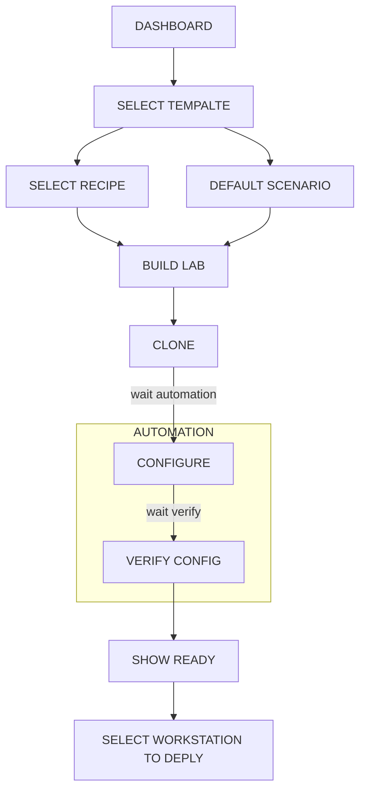

```mermaid
flowchart TD

    dhb["DASHBOARD"]
    st["SELECT TEMPALTE"]
    recp["SELECT RECIPE"]
    def["DEFAULT SCENARIO"]
    build["BUILD LAB"]
    clone["CLONE"]
    subgraph auto["AUTOMATION"]
        config["CONFIGURE"]
        verify["VERIFY CONFIG"]
    end
    deploy["SHOW READY"]
    slt_user["SELECT WORKSTATION TO DEPLY"]

    dhb --> st --> recp
    st --> def
    recp --> build
    def --> build
    build --> clone
    clone -- "wait automation" --> config -- "wait verify" --> verify --> deploy --> slt_user

```